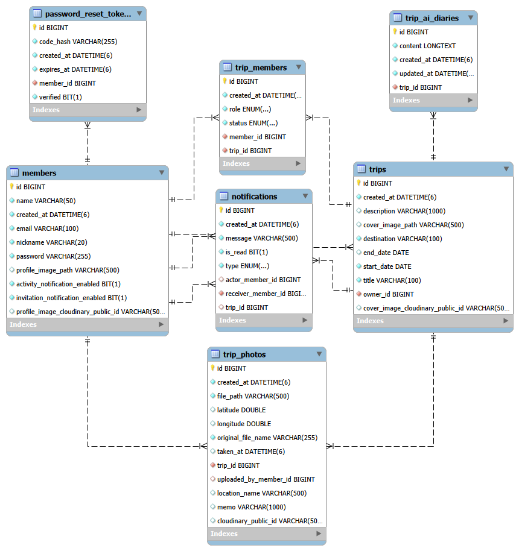

# Travel Story Backend

사진의 촬영 시간과 위치 정보를 기반으로 여행 기록을 구성하고,  
동행자를 초대해 함께 기록을 공유할 수 있는 **Travel Story 웹 서비스의 Backend**입니다.

회원 인증, 여행 및 참여자 관리, 사진 업로드, 위치 정보 처리,  
알림, AI 여행기 생성 등의 기능을 REST API로 제공합니다.

사진 업로드 시 EXIF 메타데이터에서 촬영 시간과 GPS 좌표를 추출하고,  
좌표를 장소명으로 변환하여 여행 타임라인과 지도에서 활용할 수 있도록 구성했습니다.

---

## Repository

- **Frontend:** https://github.com/ShinWonJin01/travel-story-frontend
- **Backend:** https://github.com/ShinWonJin01/travel-story-backend

## Live Demo

- **Service:** https://travelstory-sgcp.onrender.com

> 배포 서버가 일정 시간 사용되지 않은 경우 첫 요청 시 서버 기동으로 인해 응답이 다소 지연될 수 있습니다.

---

## Deployment

Travel Story는 Frontend와 Backend를 분리하여 배포하고,  
운영 데이터베이스는 TiDB Cloud를 사용하도록 구성했습니다.

```text
User
  ↓
Vue Frontend
  ↓
REST API
  ↓
Spring Boot Backend
  ↓
TiDB Cloud
```

운영 환경에서는 소스 코드에 DB 접속 정보나 Secret을 직접 저장하지 않고,  
Render의 환경변수를 통해 Backend 설정을 주입하도록 구성했습니다.

### Production

- Frontend: Render
- Backend: Render
- Backend Runtime: Docker
- Database: TiDB Cloud
- Database Protocol: MySQL Compatible
- Location: Kakao Local API / Nominatim
- AI: Gemini API
- Mail: Gmail API (OAuth 2.0)

개발 환경과 운영 환경의 설정은 Spring Profile을 통해 분리했습니다.

---

## Tech Stack

### Backend

- Java 21
- Spring Boot 4.1
- Spring Web MVC
- Spring Data JPA
- Spring Security
- Spring Security OAuth2 Resource Server
- JWT
- Bean Validation

### Database

- MySQL
- TiDB Cloud

### File / Metadata

- Metadata Extractor
- Multipart File Upload

### External API / Service

- Kakao Local API
- Nominatim Reverse Geocoding
- Gemini API
- Gmail API (OAuth 2.0)

### Build / Deployment / Tool

- Maven
- Docker
- Render
- Git / GitHub
- VS Code
- MySQL Workbench

---

## Main Features

### Authentication

- 회원가입
- 로그인
- JWT 발급 및 인증
- 인증된 사용자 정보 조회
- Spring Security 기반 API 접근 제어
- BCrypt 기반 비밀번호 암호화
- 이메일 인증 기반 비밀번호 재설정

### User

- 회원 정보 조회
- 프로필 정보 수정
- 프로필 이미지 등록 및 삭제
- 초대 알림 설정 조회 및 변경
- 비밀번호 변경
- 회원 탈퇴

### Trip

- 여행 생성
- 여행 목록 조회
- 여행 상세 조회
- 여행 정보 수정 및 삭제
- 여행 요약 정보 조회
- 여행 대표 이미지 등록 및 삭제
- 여행 참여자 관리
- 여행별 사용자 접근 권한 검증

### Invitation

- 여행 참여자 초대
- 받은 초대 조회
- 보낸 초대 조회
- 초대 수락
- 초대 거절
- 초대 취소
- 초대 상태 관리

### Photo

- 여행 사진 업로드 및 조회
- 사진 파일 조회 및 삭제
- EXIF 촬영 시간 추출
- EXIF GPS 좌표 추출
- GPS 좌표 기반 장소명 자동 변환
- 사진 메모 등록 및 수정
- 촬영 시간 수정
- 사진 위치 수정
- 사진 위치 정보 삭제
- 이미지 파일 형식 및 크기 검증
- 사용자 권한에 따른 사진 수정·삭제 제어

### Location

- 사진 위도·경도 정보 저장
- Kakao Local API 기반 장소명·주소 검색
- 좌표 기반 역지오코딩
- Kakao API 우선 사용
- Kakao 결과가 없는 경우 Nominatim 기반 역지오코딩
- 위치 수정 시 위도·경도 범위 검증
- 여행 지도에 필요한 위치 정보 제공

### AI Travel Diary

- 여행별 AI 여행기 조회
- Gemini API 기반 AI 여행기 생성 및 재생성
- 여행 제목, 지역, 기간, 설명 정보 활용
- 사진의 촬영 시간, 위치, 메모를 활용한 여행 기록 생성
- 사진 촬영 시간 순서에 따른 여행 흐름 구성
- 여행 소유자만 AI 여행기 생성 가능
- 여행 소유자와 참여자는 생성된 여행기 조회 가능

### Notification

- 사용자 알림 조회
- 읽지 않은 알림 개수 조회
- 개별 알림 읽음 처리
- 모든 알림 읽음 처리
- 여행 초대 및 참여 상태 변경에 따른 알림 생성

### Home

- 최근 여행 정보 제공
- 최근 활동 내역 조회
- 여행 관련 활동 정보 제공

---

## Backend Architecture

Backend는 Controller, Service, Repository 계층을 분리하여 구성했습니다.

```text
Vue Frontend
      ↓
REST API
      ↓
Spring Security
      ↓
Controller
      ↓
Service
      ↓
Repository
      ↓
MySQL / TiDB
```

외부 서비스가 필요한 기능은 Service 계층에서 별도로 처리하도록 구성했습니다.

```text
Service
 ├── Kakao Local API
 ├── Nominatim
 ├── Gemini API
 └── Gmail API
```

Controller는 HTTP 요청과 응답 처리를 담당하고,  
Service에서는 비즈니스 로직과 사용자 권한 검증을 수행합니다.

Repository에서는 Spring Data JPA를 통해 데이터베이스 접근을 처리하여  
각 계층의 역할이 하나의 코드에 집중되지 않도록 구성했습니다.

---

## Database / ERD

Travel Story의 주요 데이터는 회원, 여행, 참여자, 사진, 알림,  
AI 여행기 및 비밀번호 재설정 인증 정보로 구성됩니다.

주요 테이블은 다음과 같습니다.

- `members`
- `trips`
- `trip_members`
- `trip_photos`
- `trip_ai_diaries`
- `notifications`
- `password_reset_tokens`



회원과 여행을 중심으로 참여자, 사진, 알림 데이터를 연결하고,  
여행별 AI 여행기와 비밀번호 재설정 인증 정보를 별도로 관리하도록 구성했습니다.

로컬 환경에서는 MySQL을 사용하며,  
운영 환경에서는 MySQL 호환 데이터베이스인 TiDB Cloud를 사용합니다.

Spring Data JPA를 통해 동일한 데이터 접근 구조를 유지하도록 구성했습니다.

---

## Project Structure

```text
src/main/java/com/shinwonjin/travelstory
├── config
│   ├── CorsConfig.java
│   ├── JwtConfig.java
│   ├── PasswordConfig.java
│   └── SecurityConfig.java
│
├── controller
│   ├── AuthController.java
│   ├── HomeController.java
│   ├── LocationSearchController.java
│   ├── MemberController.java
│   ├── NotificationController.java
│   ├── TripAiDiaryController.java
│   ├── TripController.java
│   ├── TripCoverImageController.java
│   ├── TripInvitationController.java
│   ├── TripParticipantController.java
│   └── TripPhotoController.java
│
├── dto                    # 요청·응답 DTO
├── entity                 # JPA Entity
├── exception              # 예외 처리
├── repository             # Spring Data JPA Repository
├── service                # 비즈니스 로직
└── TravelStoryBackendApplication.java

src/main/resources
├── application.properties
└── application-prod.properties
```

Controller에서 직접 데이터 접근을 수행하지 않고,  
Service와 Repository를 통해 요청 처리와 데이터 접근을 분리하도록 구성했습니다.

---

## Authentication Flow

로그인 성공 시 Backend에서 JWT를 발급하고,  
인증이 필요한 API 요청에서는 Authorization Header의 토큰을 검증하여 사용자를 확인합니다.

```text
Login Request
      ↓
Member Authentication
      ↓
JWT Issue
      ↓
Frontend
      ↓
Authorization: Bearer <token>
      ↓
Spring Security
      ↓
JWT Validation
      ↓
Protected REST API
```

회원가입, 로그인, 비밀번호 재설정 API를 제외한 주요 API는  
JWT 인증을 요구하도록 Spring Security에서 설정했습니다.

Backend는 서버 세션을 사용하지 않는 Stateless 방식으로 구성했습니다.

---

## Authorization

JWT 인증만으로 사용자의 모든 데이터 접근을 허용하지 않고,  
요청한 사용자와 여행 또는 사진의 관계를 Service 계층에서 추가로 확인합니다.

### Trip Access

여행 데이터 조회 및 기능 사용 시 다음 정보를 기준으로 접근 권한을 확인합니다.

- 여행 소유자 여부
- 여행 참여자로 수락된 사용자 여부

### Photo Access

사진 수정 기능에서는 기능에 따라 보다 세부적인 권한을 확인합니다.

예를 들어 사진 위치 수정 및 삭제에서는 다음 조건을 적용합니다.

- 여행 소유자는 수정 가능
- 사진을 직접 업로드한 사용자는 현재 여행의 승인된 참여자인 경우 수정 가능
- 관계가 없는 사용자는 수정 불가

또한 요청의 `tripId`와 실제 사진이 속한 여행이 일치하는지 확인하여  
다른 여행의 사진 ID를 이용한 접근을 제한합니다.

이를 통해 인증(Authentication)과 데이터 단위의 권한 검증(Authorization)을  
분리하여 처리했습니다.

---

## Photo Metadata Flow

사진 업로드 시 EXIF 메타데이터를 확인하여  
촬영 시간과 위치 정보를 자동으로 추출합니다.

```text
Photo Upload
      ↓
File Validation
      ↓
EXIF Metadata Extraction
      ↓
Taken At / GPS
      ↓
Reverse Geocoding
      ↓
Location Name
      ↓
File Storage
      ↓
Database Save
```

### EXIF Metadata

사진에서 다음 정보를 추출합니다.

- 촬영 시간
- 위도
- 경도

GPS 정보가 존재하지 않는 사진은 위치 정보 없이 저장할 수 있으며,  
이후 Frontend의 장소 검색 또는 지도 기능을 통해 위치를 추가할 수 있습니다.

---

## Location Processing

사진에 GPS 좌표가 포함되어 있는 경우  
Backend에서 역지오코딩을 수행해 사용자에게 표시할 장소명을 생성합니다.

```text
Latitude / Longitude
        ↓
Kakao Reverse Geocoding
        ↓
Result Available?
   ┌────┴────┐
  Yes        No
   ↓          ↓
Location   Nominatim
 Name         ↓
          Location Name
```

국내 위치는 Kakao API를 우선 사용하며,  
Kakao에서 적절한 결과를 얻지 못한 경우 Nominatim을 보조 수단으로 사용합니다.

Nominatim 요청에는 최소 호출 간격을 적용하여  
연속적인 외부 API 요청을 제어하도록 구성했습니다.

---

## AI Travel Diary Flow

AI 여행기는 Gemini API를 활용하여 생성합니다.

```text
Trip
 ├── Title
 ├── Destination
 ├── Period
 └── Description

Trip Photos
 ├── Taken At
 ├── Location
 └── Memo
      ↓
Prompt Creation
      ↓
Gemini API
      ↓
AI Travel Diary
      ↓
Database
```

사진 자체의 이미지 내용을 분석하는 방식이 아니라,  
여행 정보와 사진에 저장된 촬영 시간, 위치, 메모를 기반으로 여행기를 생성합니다.

사진 기록은 촬영 시간 순으로 정렬하여 Prompt에 전달하며,  
제공되지 않은 장소나 행동을 임의로 생성하지 않도록 Prompt 조건을 적용했습니다.

AI 여행기는 여행 소유자만 생성 또는 재생성할 수 있으며,  
여행에 참여 중인 사용자는 생성된 여행기를 조회할 수 있습니다.

---

## Password Reset Flow

비밀번호를 잊은 경우 이메일 인증번호를 통해  
비밀번호를 재설정할 수 있도록 구현했습니다.

```text
Password Reset Request
        ↓
Email Check
        ↓
Verification Code
        ↓
Gmail API
        ↓
Code Verification
        ↓
New Password
        ↓
BCrypt Encryption
        ↓
Password Update
```

인증 메일은 Gmail API와 OAuth 2.0 인증을 통해 발송합니다.

OAuth Client ID와 Client Secret, Refresh Token을 이용하여  
Backend가 메일 발송 권한을 인증하도록 구성했습니다.

인증번호는 일정 시간이 지나면 만료되며,  
DB에는 인증번호 원문 대신 암호화된 값을 저장합니다.

또한 가입되지 않은 이메일을 입력하더라도  
회원 존재 여부가 외부에 직접 노출되지 않도록 동일한 형태의 응답을 반환하도록 구성했습니다.

---

## File Upload Security

프로필 이미지와 여행 사진 등의 업로드 파일은  
저장 전에 여러 단계의 검증을 수행합니다.

- JPEG, PNG, WebP 형식만 허용
- 최대 10MB 파일 크기 제한
- MIME Type 검증
- 이미지 파일 Header Signature 검증
- UUID 기반 서버 저장 파일명 생성
- 사용자 입력 파일명을 실제 저장 파일명으로 직접 사용하지 않음
- 프로필과 여행 이미지 저장 경로 분리
- 정규화된 저장 경로 검증
- 허용된 디렉터리 외부 접근 차단
- 파일 삭제 시 저장 경로 재검증

```text
Uploaded File
     ↓
Size Check
     ↓
Content-Type Check
     ↓
File Signature Check
     ↓
UUID File Name
     ↓
Path Validation
     ↓
File Storage
```

이를 통해 확장자 또는 MIME Type만 위조한 비정상적인 파일 업로드와  
파일 경로 조작 가능성을 줄이도록 구현했습니다.

---

## Environment Configuration

프로젝트 실행에 필요한 Secret과 외부 서비스 설정은  
소스 코드에 직접 작성하지 않고 환경변수로 관리합니다.

### Local Environment

데이터베이스, JWT 및 외부 API 사용을 위해 다음 설정이 필요합니다.

```text
TRAVEL_DIARY_DB_USERNAME
TRAVEL_DIARY_DB_PASSWORD
TRAVEL_DIARY_JWT_SECRET
KAKAO_REST_API_KEY
GEMINI_API_KEY
```

Gmail API를 통한 인증 메일 발송에는 다음 OAuth 2.0 정보가 필요합니다.

- OAuth Client ID
- OAuth Client Secret
- Refresh Token
- 메일 발송 계정 정보

해당 값 역시 소스 코드에 직접 작성하지 않고 환경변수로 관리합니다.

기본 로컬 DB 설정은 다음 주소를 사용합니다.

```text
jdbc:mysql://localhost:3306/travel_diary
```

### Production Environment

운영 환경에서는 추가로 다음 값을 환경변수로 관리합니다.

```text
TRAVEL_DIARY_DB_URL
TRAVEL_DIARY_FRONTEND_URL
```

운영 환경에서는 Render에서 환경변수를 주입하고,  
`TRAVEL_DIARY_DB_URL`을 통해 TiDB Cloud에 연결하도록 구성했습니다.

운영 프로필에서는 다음과 같이 개발 환경과 설정을 분리했습니다.

- SQL 출력 비활성화
- Hibernate Schema 자동 변경 대신 검증 사용
- 운영 DB URL 환경변수 사용
- 허용 Frontend Origin 환경변수 사용
- Proxy 환경을 고려한 Forward Header 처리

> DB 비밀번호, JWT Secret, API Key, OAuth Client Secret, Refresh Token 등의 실제 값은 GitHub Repository에 업로드하지 않습니다.

---

## How to Run

### 1. Repository Clone

```bash
git clone https://github.com/ShinWonJin01/travel-story-backend.git
cd travel-story-backend
```

### 2. Requirements

실행 전 다음 환경이 필요합니다.

- Java 21
- MySQL

### 3. Environment Variables

위의 `Environment Configuration` 항목에 있는  
환경변수를 로컬 실행 환경에 설정합니다.

### 4. Run Backend

Windows PowerShell 기준:

```bash
.\mvnw.cmd spring-boot:run
```

macOS / Linux:

```bash
./mvnw spring-boot:run
```

기본 서버 주소:

```text
http://localhost:8080
```

### 5. Build

Windows:

```bash
.\mvnw.cmd clean package
```

macOS / Linux:

```bash
./mvnw clean package
```

---

## Frontend

Frontend는 Vue 3와 TypeScript 기반의 별도 프로젝트로 구성되어 있습니다.

**Frontend Repository**

https://github.com/ShinWonJin01/travel-story-frontend

Frontend에서는 REST API를 통해 다음 기능을 사용합니다.

- 회원 및 인증
- 여행
- 참여자
- 사진
- 위치
- 초대
- 알림
- AI 여행기

---

## My Role

개인 프로젝트로 기획부터 Frontend와 Backend 구현, 배포까지  
전체 웹 서비스 개발을 진행했습니다.

Backend에서는 다음 기능을 구현했습니다.

- Java 21과 Spring Boot 기반 REST API 설계 및 구현
- Spring Data JPA 기반 데이터 저장·조회·수정 처리
- Spring Security와 JWT 기반 Stateless 인증 구현
- BCrypt 기반 비밀번호 암호화
- Gmail API와 OAuth 2.0 기반 이메일 인증 및 비밀번호 재설정 기능 구현
- 여행 생성·조회·수정·삭제 기능 구현
- 여행 대표 이미지 관리 기능 구현
- 여행 참여자 및 초대 관리 기능 구현
- 사용자와 여행의 관계를 기준으로 한 권한 검증
- 사진 업로드 및 파일 관리 기능 구현
- EXIF 촬영 시간 및 GPS 정보 추출
- Kakao 및 Nominatim 기반 역지오코딩 구현
- 사진 메모, 촬영 시간, 위치 수정 기능 구현
- 사진 위치 정보 삭제 기능 구현
- Kakao Local API 기반 장소 검색 API 구현
- Gemini API 기반 AI 여행기 생성 기능 구현
- 알림 조회, 개별 읽음 및 전체 읽음 처리 구현
- 프로필 및 사용자 설정 관리 기능 구현
- 이미지 파일 형식·크기·Header Signature 검증
- 파일 저장·삭제 경로 검증
- DB, JWT, 외부 API Key 및 OAuth 인증 정보 환경변수 분리
- 개발 환경과 운영 환경 설정 분리
- Docker 기반 Backend 실행 환경 구성
- Render 기반 Backend 배포
- TiDB Cloud 운영 데이터베이스 연결
- Frontend 배포 환경에 맞춘 CORS 및 운영 설정 구성

---

## Troubleshooting

### 1. 사진 GPS 좌표의 장소명 변환 정확도 개선

#### Problem

사진 EXIF에서 GPS 좌표를 정상적으로 추출하더라도,  
좌표값만으로는 사용자에게 여행 장소를 직관적으로 보여주기 어려웠습니다.

또한 하나의 역지오코딩 서비스만 사용할 경우  
국내 장소가 지나치게 단순한 행정구역명으로 표시되거나  
일부 좌표에서 원하는 수준의 장소명을 얻지 못하는 경우가 있었습니다.

#### Cause

GPS 메타데이터에는 위도와 경도만 포함되어 있으며,  
사용자가 이해하기 쉬운 건물명이나 주소를 얻으려면  
별도의 역지오코딩 과정이 필요했습니다.

또한 외부 위치 서비스마다 제공하는 지역과 장소 정보의 범위가 달랐습니다.

#### Solution

국내 좌표는 Kakao API를 먼저 호출하도록 구현했습니다.

Kakao 결과에서는 가능한 경우 건물명과 도로명 주소를 우선 사용하고,  
결과를 얻지 못한 경우 Nominatim을 통해 추가 역지오코딩을 수행하도록 구성했습니다.

Nominatim 요청에는 최소 호출 간격을 적용하여  
연속적인 요청을 제한했습니다.

#### Result

사진의 GPS 좌표를 단순한 숫자로 저장하는 것에서 끝나지 않고,  
사용자가 여행 기록에서 확인할 수 있는 장소명으로 변환할 수 있게 되었습니다.

또한 Kakao와 Nominatim을 조합해  
하나의 위치 서비스에만 의존하던 구조를 보완했습니다.

---

### 2. 사진 위치 수정 권한 세분화

#### Problem

JWT 인증만 확인하면 로그인한 사용자라는 사실은 알 수 있지만,  
해당 사용자가 특정 여행 사진의 위치를 수정할 권한이 있는지는 판단할 수 없었습니다.

URL의 여행 ID나 사진 ID를 임의로 변경할 경우  
다른 여행의 데이터에 접근하지 못하도록 별도의 검증이 필요했습니다.

#### Cause

Authentication과 Authorization은 서로 다른 과정이며,  
JWT가 유효하다는 사실만으로 개별 여행 데이터에 대한 수정 권한까지 보장할 수 없었습니다.

#### Solution

사진 수정 요청 시 Service 계층에서 다음 내용을 확인하도록 구현했습니다.

- 요청한 사진이 실제 해당 여행에 속하는지 확인
- 요청자가 여행 소유자인지 확인
- 요청자가 사진을 직접 업로드한 사용자인지 확인
- 사진 업로드 사용자가 현재 여행의 승인된 참여자인지 확인

여행 소유자는 사진 위치를 수정할 수 있고,  
일반 참여자의 경우 자신이 직접 업로드한 사진에 대해서만 수정할 수 있도록 제한했습니다.

#### Result

JWT 인증 이후에도 데이터 단위의 권한 검증을 추가하여  
다른 사용자의 여행 또는 사진 데이터를 임의로 수정할 가능성을 줄였습니다.

---

### 3. 배포 환경의 CORS 문제 해결

#### Problem

로컬에서는 Frontend와 Backend 통신이 정상적으로 동작했지만,  
Frontend와 Backend를 각각 배포하면서 요청 Origin이 달라졌습니다.

이에 따라 운영 환경에서 Backend 요청이  
CORS 정책에 의해 차단될 수 있었습니다.

#### Cause

Backend가 허용하는 Origin과  
실제로 배포된 Frontend 주소가 일치해야 브라우저에서 요청을 허용할 수 있습니다.

#### Solution

Spring Security에서 CORS 설정을 활성화하고,  
허용할 Frontend Origin을 설정값으로 분리했습니다.

로컬 환경에서는 개발 서버 주소를 사용하고,  
운영 환경에서는 `TRAVEL_DIARY_FRONTEND_URL` 환경변수를 통해  
실제 배포된 Frontend 주소를 지정하도록 구성했습니다.

#### Result

개발 환경과 운영 환경의 Frontend 주소를 코드 변경 없이 관리할 수 있게 되었으며,  
모든 Origin을 개방하지 않고 필요한 Frontend 주소만 허용할 수 있도록 개선했습니다.

---

### 4. 위치 정보 수정과 삭제 기능 분리

#### Problem

사진의 위치가 잘못된 경우 다른 위치로 변경할 수는 있었지만,  
위치 정보 자체가 존재하지 않아야 하는 사진에서는  
기존 좌표와 장소명을 완전히 제거할 방법도 필요했습니다.

#### Solution

사진 위치 수정 API와 위치 삭제 API를 별도로 구성했습니다.

위치 수정 시에는 위도와 경도의 유효 범위를 검증하고,  
장소명이 전달되지 않은 경우 좌표를 이용해 역지오코딩을 수행합니다.

위치 삭제 시에는 저장된 위도, 경도와 장소명 정보를 함께 제거하도록 구현했습니다.

#### Result

사진의 위치를 다른 장소로 변경하는 경우와  
위치 정보를 완전히 제거하는 경우를 구분하여 처리할 수 있게 되었습니다.

---

### 5. 배포 환경에서 Gmail 인증 메일 발송 구성

#### Problem

비밀번호 재설정 인증 메일을 로컬뿐 아니라  
배포된 Backend에서도 안정적으로 발송할 수 있는 인증 방식이 필요했습니다.

또한 Gmail 계정의 비밀번호를 Backend에 직접 저장하는 방식은 피해야 했습니다.

#### Solution

Gmail API의 `gmail.send` 권한을 사용하고,  
OAuth 2.0 Client ID, Client Secret과 Refresh Token을 이용해  
Backend가 메일 발송 권한을 인증하도록 구성했습니다.

OAuth 인증에 필요한 값은 Render 환경변수로 분리하여  
소스 코드와 GitHub Repository에 포함되지 않도록 관리했습니다.

#### Result

Gmail 계정 비밀번호를 직접 사용하지 않고도  
배포된 Backend에서 비밀번호 재설정 인증 메일을 발송할 수 있도록 구성했습니다.

Refresh Token을 활용하여 서버 재기동 이후에도  
메일 발송에 필요한 인증을 다시 수행할 수 있도록 했습니다.

---

## Security

운영 환경을 고려해 다음과 같은 기본 보안 조치를 적용했습니다.

- Spring Security 기반 API 보호
- JWT 기반 Stateless 인증
- BCrypt 기반 비밀번호 암호화
- 인증이 필요한 API와 공개 API 분리
- 여행·사진 단위 사용자 권한 검증
- 요청된 여행 ID와 실제 데이터 관계 검증
- 비밀번호 재설정 인증번호 암호화 저장
- 비밀번호 재설정 인증번호 만료 처리
- 회원 존재 여부를 직접 노출하지 않는 비밀번호 재설정 응답
- Gmail API OAuth 2.0 인증 정보 환경변수 관리
- DB 접속 정보 환경변수 관리
- JWT Secret 환경변수 관리
- 외부 API Key 환경변수 관리
- JPEG / PNG / WebP 파일만 허용
- 업로드 파일 크기 제한
- MIME Type 및 File Signature 검증
- UUID 기반 저장 파일명 생성
- 파일 저장·조회·삭제 경로 검증
- CORS 허용 Origin 제한
- 서버 오류 응답에서 내부 Stack Trace 및 상세 Message 노출 제한
- 운영 환경 SQL 로그 비활성화